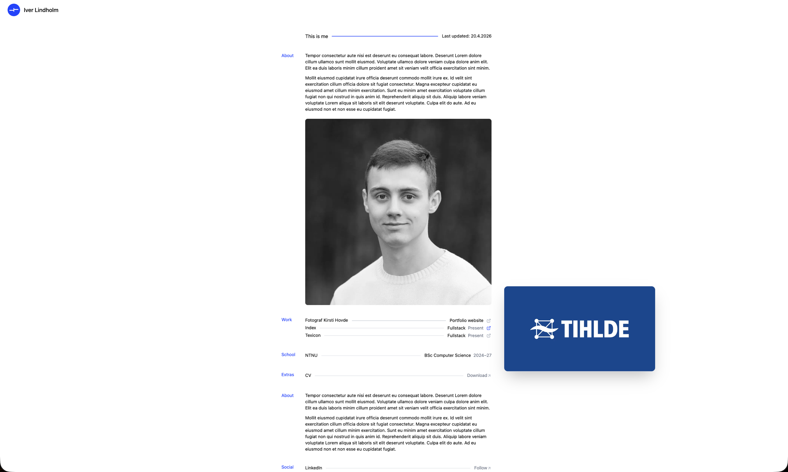

# Iver Lindholm's Portfolio Website 🌟

Welcome to my spot on the world wide web! This is my portfolio website, built with SvelteKit, where I showcase my work, skills, and journey as a developer. Explore my projects, learn about me, and see what I'm all about! 🚀



## 📖 Table of Contents

- [Tech Stack](#tech-stack-)
- [Getting Started](#getting-started-)
- [Project Structure](#project-structure)
- [Contact](#contact-)
- [License](#license-)

## Tech Stack 🛠️

This portfolio is powered by modern and lightweight tools:

| Category                  | Technology       |
| ------------------------- | ---------------- |
| Framework                 | SvelteKit        |
| Runtime                   | Bun              |
| Styling                   | Tailwind CSS     |
| Content                   | MDsveX           |
| Deployment                | Railway          |
| Version Control           | Git              |
| Linting / Code Quality    | ESLint, Prettier |

## Getting Started ⚙️

Follow the steps below to run this project locally.

### Prerequisites

Make sure you have the following installed:

- [Bun](https://bun.sh/) (or Node.js with npm/pnpm/yarn)
- [Git](https://git-scm.com/)

### Installation

```sh
# Clone the repository
git clone https://github.com/Alivki/iver-lindholm.git
cd iver-lindholm

# Install dependencies
bun install

# Start the development server
bun run dev
```

### Building

```sh
# Create a production build
bun run build

# Start the production server
bun run start
```

## Project Structure

```
iver-lindholm/
├── src/                # Source files (routes, components, lib)
│   ├── lib/            # Shared components and utilities
│   ├── routes/         # SvelteKit routes and pages
│   ├── app.html        # HTML template
│   └── app.d.ts        # TypeScript app declarations
├── static/             # Static assets (images, robots.txt, etc.)
├── svelte.config.js    # SvelteKit configuration
├── vite.config.ts      # Vite configuration
├── eslint.config.js    # ESLint configuration
├── package.json        # Project metadata and scripts
└── README.md           # You are here!
```

## Contact 📬

I'd love to connect — whether you're interested in collaboration, have feedback, or just want to say hello!

| Platform               | Link                                                                 |
| ---------------------- | -------------------------------------------------------------------- |
| 📧 Email               | [iver.lindholm@gmail.com](mailto:iver.lindholm@gmail.com)            |
| 💼 LinkedIn            | [linkedin.com/in/iver-lindholm](https://www.linkedin.com/in/iver-lindholm/) |
| 🌐 Portfolio / Website | [iverlindholm.no](https://iverlindholm.no)                           |

## License 📝

This project is licensed under the MIT License.
See the [LICENSE](./LICENSE) file for more information.

---

Built with 💖 by Iver Lindholm
© 2026 All rights reserved.
